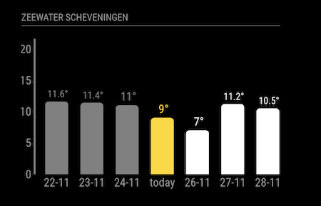

# MMM-SeaConditions v1.0
This MagicMirror² module fetches sea conditions from an API and displays them on the mirror. The module displays a bar graph for a week, including 3 days forecast.

The current version returns sea surface temperatures for a given location, 
but in the future I may include other conditions like waves, air temperature and wind. I also want to include yearly averages etc...



## Installation

### Install

In your terminal, go to your [MagicMirror²][mm] Module folder and clone MMM-SeaConditions:

```bash
cd ~/MagicMirror/modules
git clone https://github.com/HarrieV8/MMM-SeaConditions

```

### Update

```bash
cd ~/MagicMirror/modules/MMM-SeaConditions
git pull
```

## Using the module

To use this module, add a minimum configuration in the modules array in the `config/config.js` file:

```js
    {
        module: 'MMM-SeaConditions',
        position: 'top_right',
        config: {
	    apiKey: "BuNcHofNuMbersAndLetters" // your API key from rapid API com
        }
    },
```

Or you could use all the options:

```js
    {
        module: 'MMM-SeaConditions',
        position: 'top_right',
        header: 'Zeewater Scheveningen',
        config: {
            lat: "52.1107",                     // latlon for North Sea Scheveningen beach
            lon: "4.2626",                      // in string format for url
	    apiKey: "BuNcHofNuMbersAndLetters", // your API key from rapid API com
            reloadInterval: 12*60*60*1000,      // reload every 12 hours
	    units: "F"                          // show temps in F (Fahrenheit)
        }
    },
```

This module uses a rapidAPI.com API, documentation can be found here:
https://rapidapi.com/pavelzusko/api/sea-surface-temperature 

Register at the site to get your personal API key, which you need to access the API. They currently offer a free plan (date 25-11-2024!) that allows for 100 calls per month, so I have kept the default refresh rate at once a day. 

## Configuration options

Option|Possible values|Default|Description
------|------|------|-----------
`apiKey`| | empty | your personal API key
`lat`|`-90` -  `90` | `"52.1107"` (North Sea near The Hague)| Latitude of sea location 
`lon`|`-180` -  `180` | `"4.2626"` (North Sea near The Hague)| Longitude of sea location
`reloadInterval`| |`1000*60*60*24` | reload interval of content in msec. See section API documentation
`units`|`"C"`, `"F"` | `"C"` | show temps in Celcius or Fahrenheit
`height`| | `"250px"` | sets a fixed height for the module

## Custom css

Some module style properties can be set through a module specific style in /css/custom.css:

```css
.MMM-SeaConditions {
    font-size: 16px;
    width: 400px;
}
```

[mm]: https://github.com/MagicMirrorOrg/MagicMirror
